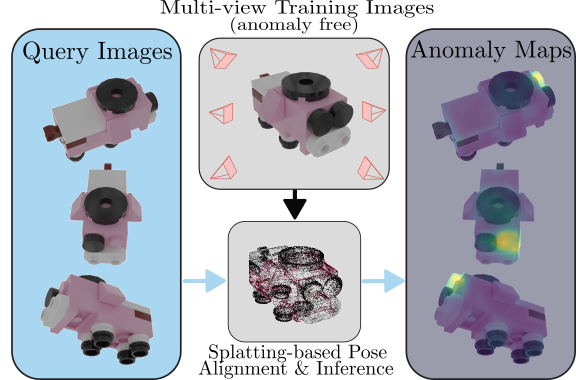

# SplatPose & Detect: Pose-Agnostic 3D Anomaly Detection 

This is the official code to the paper 
[**"SplatPose & Detect: Pose-Agnostic 3D Anomaly Detection"**](https://arxiv.org/pdf/2404.06832.pdf) 
by Mathis Kruse, Marco Rudolph, Dominik Woiwode, and Bodo Rosenhahn
which was accepted to the CVPR 2024 Workshop VAND 2.0.

 	
[](https://paperswithcode.com/sota/anomaly-detection-on-pad-dataset?p=splatpose-detect-pose-agnostic-3d-anomaly)




## Abstract:
>Detecting anomalies in images has become a well-explored problem in both academia and industry. State-of-the-art algorithms are able to detect defects in increasingly difficult settings and data modalities. However, most current methods are not suited to address 3D objects captured from differing poses. While solutions using Neural Radiance Fields (NeRFs) have been proposed, they suffer from excessive computation requirements, which hinder real-world usability. For this reason, we propose the novel 3D Gaussian splatting-based framework SplatPose which, given multi-view images of a 3D object, accurately estimates the pose of unseen views in a differentiable manner, and detects anomalies in them. We achieve state-of-the-art results in both training and inference speed, and detection performance, even when using less training data than competing methods. We thoroughly evaluate our framework using the recently proposed Pose-agnostic Anomaly Detection benchmark and its multi-pose anomaly detection (MAD) data set.


<section class="section" id="BibTeX">
  <div class="container is-max-desktop content">
    <h2 class="title">BibTeX</h2>
    <pre><code>@inproceedings{kruseSplatPose,
      author       = {Kruse, Mathis and Rudolph, Marco and Woiwode, Dominik and Rosenhahn, Bodo},
      title        = {SplatPose & Detect: Pose-Agnostic 3D Anomaly Detection},
      booktitle    = {Proceedings of the IEEE/CVF Conference on Computer Vision and Pattern Recognition (CVPR) Workshops},
      year         = {2024},
}</code></pre>
  </div>
</section>


## Installation Setup
To reproduce our results, please clone this repository and the respective submodules. We recommend creating a new conda environment and installing all necessary modules. This code has been written and only tested on a Linux machine.
```shell
# (1) Cloning the repository and the submodules recursively
git clone git@github.com:m-kruse98/SplatPose.git --recursive
cd SplatPose

# (2) Create the environment with necessary CUDA & PyTorch frameworks
conda env create --file environment.yml 
conda activate splatpose

# (3) Install remaining requirements with pip
pip install -r requirements.txt
```

You will also need the necessary retrieval models from the OmniposeAD codebase, which is also found [here](https://drive.google.com/file/d/16FOwaqQE0NGY-1EpfoNlU0cGlHjATV0V/view?usp=drive_link), and put them into the "PAD_utils" directory. Alternatively just run the code below to directly download the necessary checkpoints.
```shell
# (4) Make sure steps (1)-(3) are completed. Download the model checkpoints from the PAD repository
cd PAD_utils
gdown https://drive.google.com/uc\?id\=16FOwaqQE0NGY-1EpfoNlU0cGlHjATV0V
unzip model.zip
```

## Running the code

To run the code, we need to download the **MAD-Sim** data set from [the official repository](https://github.com/EricLee0224/PAD). The data set is ideally placed directly into the repository.

### Preparation
**Configure** the provided script ```prepare_lego_ad.py``` to **the correct paths** and run it to generate a usable data set.
```shell
python prepare_lego_ad.py
```

With standard parameters, this will create a new directory called "MAD-Sim_3dgs", which can be fed into the Gaussian Splatting Framework.


### Running Anomaly Detection

Validate that the dataset path in ```train_and_render.py``` is pointing towards the previously created directory. To start a run of SplatPose on the first class "01Gorilla" of MAD, simply run

```shell
python train_and_render.py -c 01Gorilla
```
Different options can be found using ```python train_and_render.py --help```, and used to tweak the hyperparameters.


### Running Pose Estimation
Analogously, the experiments for the pose estimation can also be repeated. First construct a suitably formatted pose estimation data set using ```prepare_subset_lego_ad.py```.

The pose estimation is validated using the corresponding script ```train_and_pose_est.py```, for which several options are again available. Other suitably formatted data sets, such as the NeRF synthetic scenes (available [here](https://github.com/bmild/nerf)), can also be used for this script.


### Credits

The Gaussian Splatting code is based on the [official repository](https://github.com/graphdeco-inria/gaussian-splatting). The MAD-Sim data set, as well as select parts of their codebase, have been taken from their [GitHub repository](https://github.com/EricLee0224/PAD) as well.

### License

The gaussian-splatting module is licensed under the respective "Gaussian-Splatting License" found in LICENSE.md.

#### Acknowledgments

This work was supported by the Federal Ministry of Education and Research (BMBF), Germany under the AI service center KISSKI (grant no. 01IS22093C), the Lower Saxony Ministry of Science and Culture (MWK) through the zukunft.niedersachsen program of the Volkswagen Foundation and the Deutsche Forschungsgemeinschaft (DFG) under Germany’s Excellence Strategy within the Cluster of Excellence PhoenixD (EXC 2122).
